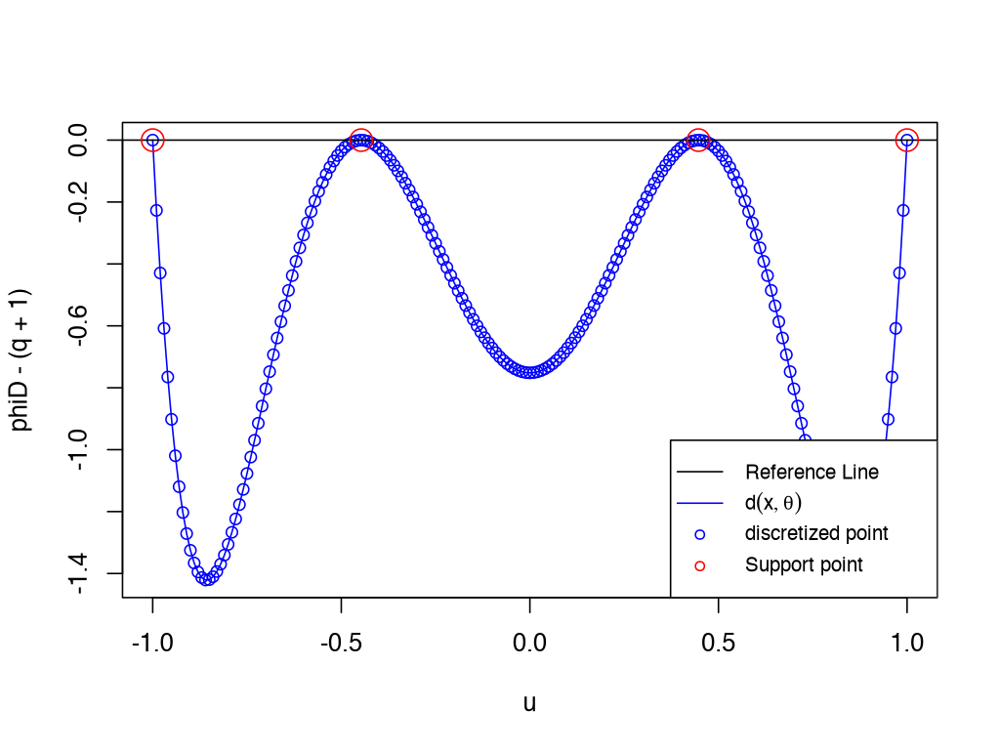

# SLSEdesign: Optimal designs using the second-order Least squares estimator 

*Chi-Kuang Yeh, Julie Zhou*

*May 14, 2024*

<!-- badges: start -->
[](https://CRAN.R-project.org/package=SLSEdesign)
[](https://github.com/chikuang/SLSEdesign/actions/workflows/R-CMD-check.yaml)
<!-- [](https://app.codecov.io/gh/chikuang/SLSEdesign?branch=master) -->
<!-- badges: end -->

---

## Description

This is a package to compute the optimal regression design under the second-order Least squares estimator 

## Installation

SLSEdesign is now available on [CRAN](https://cran.r-project.org/). Hence you may install it by typing

```r
install.packages("SLSEdesign")
```

or you may download the develop version by typing

```r
remotes::install_github("chikuang/SLSEdesign")
```

## Examples

1. Calculate the D-optimal design for the 3rd order polynomial regression model:

$$
y_i = \beta_0 + \beta_1 x_i + \beta_2 x_i^2 + \beta_3 x_i^3 +\varepsilon_i
$$

```r
poly3 <- function(xi,theta){
    matrix(c(1, xi, xi^2, xi^3), ncol = 1)
}
my_design <- Dopt(N = 31, u = seq(-1, 1, length.out = 31), 
     tt = 0, FUN = poly3, theta = rep(1, 4), num_iter = 500)
my_design$design
my_design$val
```

Add equivalence theorem plot for D-optimal design:

```r
design = data.frame(location = c(-1, -0.447, 0.447, 1),
 weight = rep(0.25, 4))
u = seq(-1, 1, length.out = 201)
plot_direction_Dopt(u, design, tt=0, FUN = poly3,
  theta = rep(0, 4))
```


## TODO

+ [x] Add doi in the DESCRIPTION file
+ [x] Add files in inst/doc/ folder
+ [x] Add examples to all the exported functions to fulfill the requirement of CRAN
+ [x] Add information matrices in the examples within the calc_directional_derivatives functions
+ [x] Upload the package to CRAN
+ [ ] Python and Julia version of the package, which are expected to be faster than in R
+ [ ] Merge the functions that compute the directional derivatives. Maybe adding an extra argument to indicate the design criterion used.

## Reference 

1. Gao, Lucy L. and Zhou, Julie. (2017). [D-optimal designs based on the second-order least squares estimator](https://link.springer.com/article/10.1007/s00362-015-0688-9). *Statistical Papers*, 58, 77–94.
2. Gao, Lucy L. and Zhou, Julie. (2014). [New optimal design criteria for regression models with asymmetric errors](https://www.sciencedirect.com/science/article/pii/S037837581400007X). *Journal of Statistical Planning and Inference*, 149, 140-151.
3. Wang, Liqun and Leblanc, Alexandre. (2008). [Second-order nonlinear least squares estimation](https://link.springer.com/article/10.1007/s10463-007-0139-z). *Annals of the Institute of Statistical Mathematics*, 60, 883–900.
4. Yeh, Chi-Kuang and Zhou, Julie. (2021). [Properties of optimal regression designs under the second-order least squares estimator](https://link.springer.com/article/10.1007/s00362-018-01076-6). *Statistical Papers*, 62, 75–92.
5. Yin, Yue and Zhou, Julie. (2017). [Optimal designs for regression models using the second-order least squares estimator](https://www.jstor.org/stable/26384103). *Statistica Sinica*, 27, 1841-1856. 
