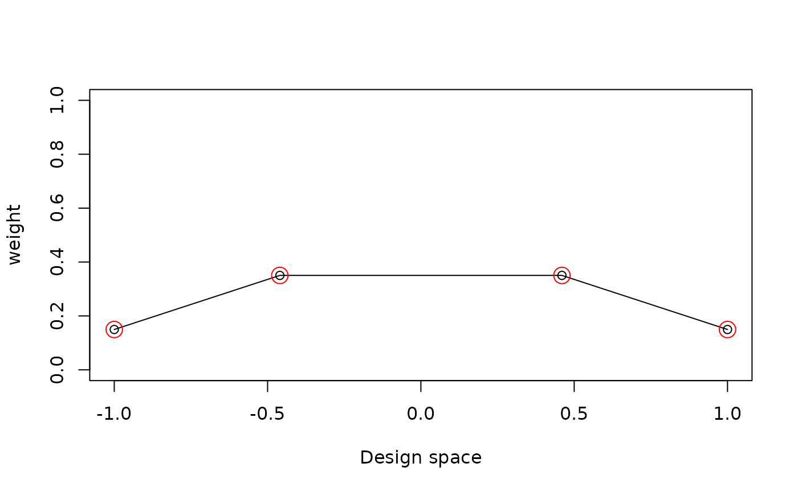
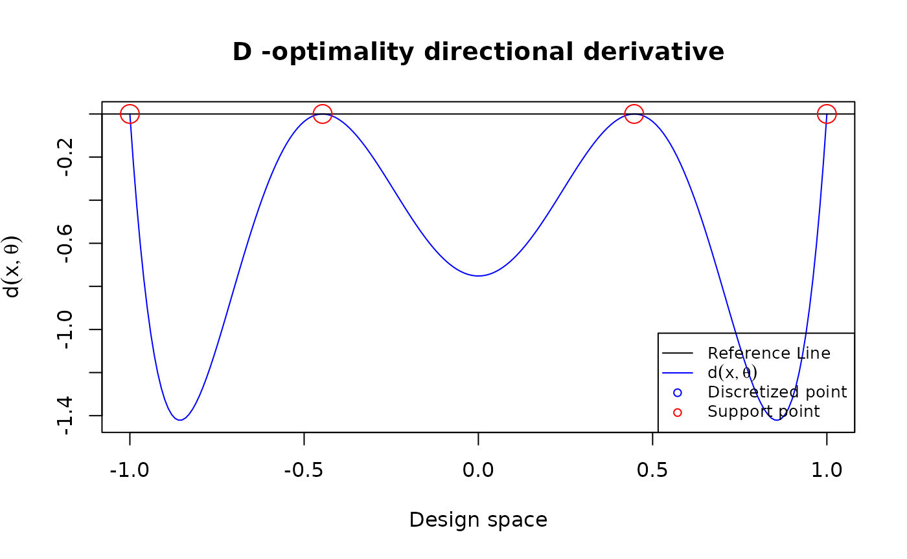
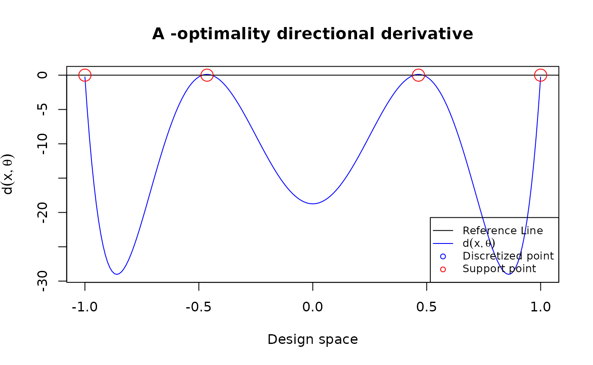
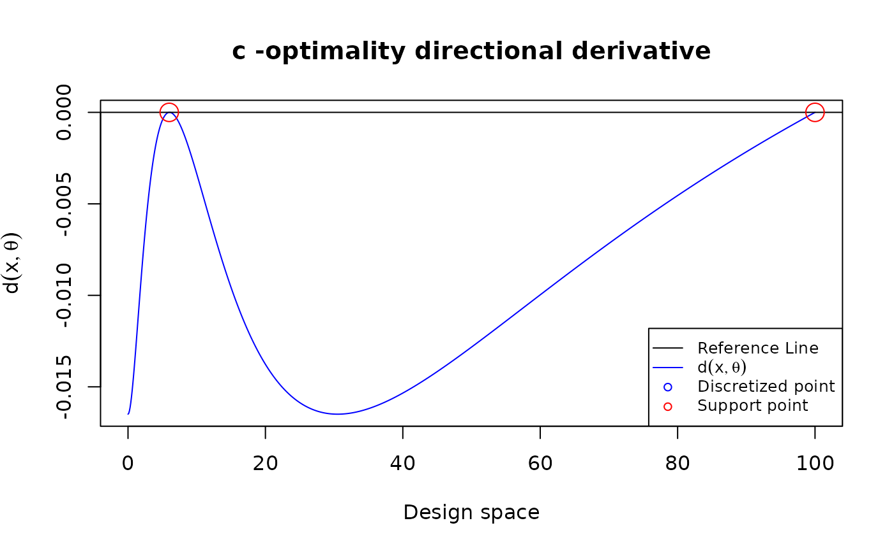

# SLSEdesign

## Installation

``` r
# required dependencies
require(SLSEdesign)
#> Loading required package: SLSEdesign
require(CVXR)
#> Loading required package: CVXR
#> 
#> Attaching package: 'CVXR'
#> The following objects are masked from 'package:stats':
#> 
#>     power, sd, var
#> The following objects are masked from 'package:base':
#> 
#>     norm, outer
```

## Specify the input for the program

1.  **N**: Number of design points

2.  **S**: The design space

3.  **tt**: The level of skewness

4.  **$\theta$**: The parameter vector

5.  **FUN**: The function for calculating the derivatives of the given
    model

``` r
N <- 101
S <- c(-1, 1)
tt <- 0
theta <- rep(1, 4)

poly3 <- function(xi,theta){
    matrix(c(1, xi, xi^2, xi^3), ncol = 1)
}

u <- seq(from = S[1], to = S[2], length.out = N)

res <- Aopt(N = N, u = u, tt = tt, FUN = poly3, 
            theta = theta)
```

### Manage the outputs

Showing the optimal design and the support points

``` r
res$val
#> [1] 37.5
res$status
#> [1] "optimal"
round(res$design, 4)
#>     location weight
#> 1      -1.00   0.15
#> 28     -0.46   0.35
#> 74      0.46   0.35
#> 101     1.00   0.15
```

Or we can plot them

``` r
plot_weight(res$design)
```



### Plot the directional derivative to use the equivalence theorem for 3rd order polynomial models

#### D-optimal design

``` r
poly3 <- function(xi,theta){
    matrix(c(1, xi, xi^2, xi^3), ncol = 1)
}
design <- data.frame(location = c(-1, -0.447, 0.447, 1),
 weight = rep(0.25, 4))
u = seq(-1, 1, length.out = 201)
plot_dispersion(u, design, tt = 0, FUN = poly3,
  theta = rep(0, 4), criterion = "D")
```



#### A-optimal design

``` r
poly3 <- function(xi, theta){
  matrix(c(1, xi, xi^2, xi^3), ncol = 1)
}
design <- data.frame(location = c(-1, -0.464, 0.464, 1),
                     weight = c(0.151, 0.349, 0.349, 0.151))
u = seq(-1, 1, length.out = 201)
plot_dispersion(u, design, tt = 0, 
                FUN = poly3, theta = rep(0,4), criterion = "A")
```



### Plot the directional derivative to use the equivalence theorem for peleg model under c-optimality

``` r
my_peleg <- function(xi, theta) {
  deno <- (theta[1] + theta[2]*xi)
  matrix(c(-xi/deno^2, -xi^2/deno^2), ncol = 1)
}
Npt <- 1001
my_u <- seq(0, 100, length.out = Npt)
my_theta <- c(0.5, 0.05)
my_cVec <- c(1, 1)
my_design <- copt(
  N = Npt, u = my_u,
  tt = 0, FUN = my_peleg, theta = my_theta,
  cVec = my_cVec
)

plot_dispersion(my_u, my_design$design, tt = 0, 
                FUN = my_peleg, theta = my_theta, 
                criterion = "c", cVec = my_cVec)
```


